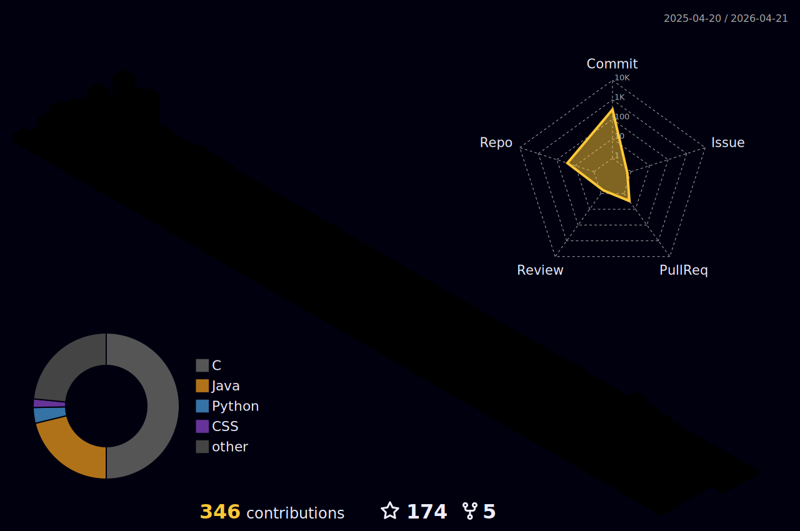

<!-- ===================================== -->
<!-- 🌟 ANIMATED HEADER -->
<!-- ===================================== -->

<h1 align="center">
  
</h1>

<b>💻 Software Development | 🚀 Problem Solving | 🎓 CSE Undergraduate</b>

<!-- ===================================== -->
<!-- 👨‍💻 ABOUT ME -->
<!-- ===================================== -->

<h2 align="center">👨‍💻 About Me</h2>

- 🎓 BSc in Computer Science & Engineering — East West University  
- 🎯 Actively preparing for Software Engineering Internships  
- 💻 Strong foundation in C, Java & JavaScript  
- 🧠 Passionate about Data Structures & Algorithms  
- 🚀 Love building clean, structured projects  
- 📫 2025-1-60-142@std.ewubd.edu  

<!-- ===================================== -->
<!-- 🧰 TECH STACK -->
<!-- ===================================== -->

<h2 align="center">🧰 Tech Stack</h2>

### 💻 Languages

### 🌐 Frontend

### 🛠 Tools & Platforms

---

<!-- ===================================== -->
<!-- 📊 MOST USED LANGUAGES -->
<!-- ===================================== -->

<h2 align="center">📊 Most Used Languages</h2>

  

---

<!-- ===================================== -->
<!-- 📊 GITHUB STATS -->
<!-- ===================================== -->

<h2 align="center">📊 GitHub Statistics</h2>

  

---

<!-- ===================================== -->
<!-- 🔥 STREAK STATS -->
<!-- ===================================== -->

<h2 align="center">🔥 Contribution Streak</h2>

  

---

<!-- ===================================== -->
<!-- 📈 CONTRIBUTION GRAPH -->
<!-- ===================================== -->

<h2 align="center">📊 3D Contribution Graph</h2>

  

<!-- ===================================== -->
<!-- 🏆 TROPHIES -->
<!-- ===================================== -->

<h2 align="center">🏆 GitHub Achievements</h2>
https://github-profile-trophy-tawny.vercel.app/?username=Mehrab30-Mehrab

---

<!-- ===================================== -->
<!-- 🧪 FEATURED PROJECTS -->
<!-- ===================================== -->

<h2 align="center">🧪 Featured Projects</h2>

🕵️ Stealth Runner — Terminal-based C Game  
🧮 Scientific Calculator — C Application  
💰 Compound Interest Calculator — Java  
🔢 Array Utility Toolkit — Java  
🌐 React + Tailwind UI Projects  

---

<!-- ===================================== -->
<!-- 🐍 CONTRIBUTION SNAKE -->
<!-- ===================================== -->

<h2 align="center">🐍 Contribution Snake</h2>

  

---

<!-- ===================================== -->
<!-- 🔗 CONNECT WITH ME -->
<!-- ===================================== -->

<h2 align="center">🔗 Connect With Me</h2>

---

<!-- ===================================== -->
<!-- 🌊 ANIMATED FOOTER -->
<!-- ===================================== -->

